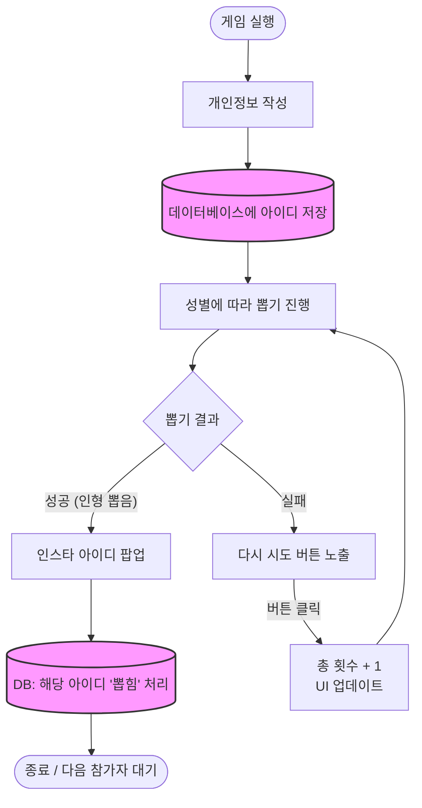

# 1. 프로젝트 개요

- **장르:** 3D 물리 기반 아케이드 게임 (오프라인 행사용)
- **개발 엔진:** Unity 3D
- **그래픽 파이프라인:** URP (Universal Render Pipeline)
- **인풋 디바이스:** 커스텀 조이스틱 & 아케이드 버튼 (USB 인코더 보드 활용)
- **백엔드/DB:** Firebase (Firestore, 익명 Auth 활용)
- **과금 방식:** 1회당 500원 (현장 계좌이체 또는 QR 결제)

상품 링크:
[인형뽑기 조이스틱](https://www.coupang.com/vp/products/9353588248?itemId=27688888169&vendorItemId=94650770953&q=%EC%9D%B8%ED%98%95%EB%BD%91%EA%B8%B0%20%EC%A1%B0%EC%9D%B4%EC%8A%A4%ED%8B%B1&searchId=26e202966648744&sourceType=search&itemsCount=60&searchRank=2&rank=2&traceId=mp2gy08x)

- **디바이스 관련 제미나이 조언**
    
    링크해주신 아케이드/인형뽑기용 조이스틱 부품만으로는 **PC에 직접 연결하여 Unity 인풋으로 사용할 수 없습니다.**
    
    하지만 **USB 신호로 변환해 주는 추가 기판**을 연결하면 완벽하게 Unity에서 게임패드 입력으로 사용할 수 있습니다.
    
    해당 조이스틱 부품은 상하좌우 방향마다 마이크로스위치(Microswitch)가 달려 있는 단순한 물리적 스위치 뭉치입니다. 이를 Unity가 구동되는 PC(Windows)에서 인식하려면, 스위치의 물리적인 접점 신호를 USB HID(Human Interface Device) 신호로 변환해 주는 장치가 중간에 반드시 필요합니다.
    
    이를 해결하기 위한 두 가지 방법을 추천해 드립니다.
    
    ### 1. 가장 쉬운 방법: USB 인코더 보드 사용 (추천)
    
    시중에서 '제로 딜레이 아케이드 USB 인코더 (Zero Delay Arcade USB Encoder)'라는 저렴한 기판을 쉽게 구할 수 있습니다.
    
    - **연결 방식:** 조이스틱의 각 방향 스위치 케이블을 이 보드의 핀에 꽂고, 보드를 PC에 USB로 연결합니다.
    - **특징:** 별도의 코딩이나 드라이버 설치 없이 Windows에서 즉시 '일반 USB 게임 컨트롤러(조이패드)'로 인식합니다.
    
    ### 2. 커스텀 방법: 마이크로컨트롤러 활용
    
    입력 신호를 커스텀하거나 추가적인 센서/버튼을 정밀하게 제어하고 싶다면 직접 컨트롤러를 제작할 수도 있습니다.
    
    - **연결 방식:** **Arduino Pro Micro** (ATmega32U4 칩셋) 또는 **Raspberry Pi Pico**의 GPIO 핀에 조이스틱 스위치를 연결합니다.
    - **특징:** C++이나 MicroPython 등을 이용해 해당 스위치가 눌렸을 때 특정 키보드 키(예: W, A, S, D)나 마우스 클릭, 또는 가상 게임패드 신호를 PC로 쏘도록 펌웨어를 직접 작성할 수 있습니다.
    
    ---
    
    ### 🎮 Unity에서의 인풋 처리
    
    위의 방법 중 하나를 통해 PC가 조이스틱을 '게임 컨트롤러'로 인식하기 시작했다면, Unity에서의 처리는 일반적인 게임패드를 다루는 것과 완전히 동일합니다.
    
    - **Legacy Input Manager (`UnityEngine.Input`):**
    Project Settings > Input Manager에서 축(Axis)을 설정하고, 스크립트에서 `Input.GetAxis("Horizontal")` 또는 `Input.GetButton("Fire1")` 등으로 값을 받아옵니다.
    - **New Input System (`UnityEngine.InputSystem`):**
    디바이스가 `Gamepad` 또는 `Joystick`으로 인식되므로, Action Map을 생성하여 바인딩하거나 C# 이벤트 콜백을 통해 더 체계적으로 입력을 관리할 수 있습니다.
    
    조이스틱과 버튼 부품, 그리고 USB 인코더 보드를 함께 구매하여 조립하시면 훌륭한 커스텀 아케이드 컨트롤러를 만들어 엔진에 연동하실 수 있습니다.
    

# 2. 핵심 게임 플로우 (Game Flow)

본 게임의 핵심은 '조작과 물리 연산은 100% 플레이어의 실력'에 달렸으며, '보상의 종류는 성공 후 백엔드 확률 연산'에 의해 결정된다는 점입니다.

- 게임 실행 → 개인정보 작성→ 데이터베이스에 아이디 저장 →  인형 뽑기 → 인형 뽑을 시 인스타 아이디 팝업→ 데이터베이스에서 뽑힌 인스타 아이디는 (뽑힘)으로 처리
- 다시 시도 버튼 → 총 횟수 +1(UI로 표시) → 인형뽑기

# 3. 세부 구현

## 확률

플레이어가 인형을 골인 박스에 성공적으로 넣었을 때만 계산됩니다.

- **보상 유형:**
    1. 아이디 + 실물 인형
    2. 인스타 아이디만 (매칭)
    3. 실물 인형만
    4. 꽝 (현장 사탕 지급)
- **동적 확률 연산:** 정해진 고정 확률이 아니라, Firebase에 기록된 `(남은 인형 개수 + 남은 아이디 개수) / 투입된 가격적 가치` 등의 **동적 계산식**을 통해 실시간으로 당첨 확률이 변동됩니다.
- **분리된 실물 연관성:** 게임 화면에서 파란 인형을 뽑든 빨간 인형을 뽑든, 최종 보상은 Firebase의 확률 로직에 의해서만 텍스트/이미지로 결정됩니다.

## 데이터 베이스

데이터 베이스 : 인스타 아이디, 총 인형 개수(실물과 매치), 시도 횟수

**`Participants` 컬렉션:** 참가자 개별 문서

| 이름 | 인스타 아이디 | 멘트 | 뽑힘 여부 | 성별 | 시도 횟수 |
| --- | --- | --- | --- | --- | --- |
| 송인서 | @i.ns..u | 원신 좋아하시는 분 찾습니다^^ | X | 남 | 15 |
| 조연우 |  | 02.청춘은.어떠신지.? |  |  |  |

**`GameState` 컬렉션:** 게임 전체 통계 (1개의 문서 공유)

| 총 인스타 개수 | 총 인형 개수 | 총 시도 횟수 | 예상 수익 |
| --- | --- | --- | --- |
| 20 | 100 | 40 | 40*500 |
|  |  |  |  |

## 물리 및 조작 세부 구현 (Physics System)

집게의 움직임을 애니메이션이 아닌 유니티 물리 엔진(Joint)으로 구현하여 실제 아케이드 기계의 리얼한 손맛을 구현합니다.

- **집게(Claw) 관절 구현:** 집게발의 각 관절을 `Hinge Joint`로 연결합니다.
- **집게 구동 (악력):** `Hinge Joint`의 `Motor` 속성(Target Velocity, Force)을 제어하여 집게를 오므리고 폅니다. 이를 통해 실제 물리 법칙에 기반한 악력이 인형에 가해집니다.
- **마찰력 세팅 (Physics Material):** 인형 콜라이더와 집게 안쪽 면의 `Bounciness`는 0으로, `Friction`은 최대치로 설정하여 쥐어진 인형이 쉽게 미끄러지지 않도록 마찰력을 극대화합니다.
- **인형 구현:** 단순한 콜라이더 덩어리가 아닌 `Ragdoll` 세팅을 적용하여, 집게에 잡혔을 때 팔다리가 축 늘어지는 사실적인 형태를 연출합니다.

## 천장(Pity) 시스템: 물리적 버프

플레이어의 좌절감을 줄이고 지속적인 도전을 유도하기 위해, 실패가 누적될 경우 기계의 **물리적 성능 자체를 향상**시킵니다.

- **발동 조건:** 플레이어의 누적 시도 횟수가 5회차에 도달했을 때 발동
- **UI 연출:** 우상단 시도 횟수 게이지가 꽉 차며 "🔥MAX 파워 모드 발동!🔥" 등 직관적이고 화려한 UI 연출
- **시스템 버프 내용:**
    **미세 자석 효과 (보조):** 집게 중앙(부모 오브젝트)에 Trigger 영역을 달고, 타겟 인형에 미세하게 위쪽으로 당겨지는 `AddForce`를 적용하여 플레이어의 조준 오차를 보정해 줍니다.
    

## 인형 풀(Pool) 설정

플레이어 성별의 **반대 성별**로 인형 풀이 결정됩니다.

- 처음 시작할 때 입력한 성별에 따라 인형 뽑기 결과의 성별이 고정
- 성별에 따라 파랑/핑크로 인형기계 외관 변경

## 인터페이스

- **화면 중앙** : 인형 뽑기 기계
- **좌상단** : 확률표(남아있는 인스타 아이디와 인형 개수 기반으로 동적으로)
- **우상단** : 시도 횟수
    - 5번 하면 뽑힐 확률 업 이런거 있으면 좋을듯?
- **우하단** : 다시 시도 버튼
    - 버튼 UI는 조이스틱으로 할 시 개별 인풋이 필요할듯

# 4. 레퍼런스

- Prize Claw
- Claw Machine SIM

---

- 회의 아이디어
    
    인형 뽑기 소개팅 - 유니티로 2D 뽑기 게임 만들기
    1. 남/녀 인스타 아이디 입력
    2. 뽑는 거는 인스타 아이디(인형 있는 아이디가 있고, 없는 것도 있음)
    3. 한 판당 500원
    
    뽑는 유형 : 아이디+인형 / 아이디 아이디 고정 말고
    1. 인형 2. 인형 +아이디 3. 아이디 4. 꽝(사탕)
    **확률은 동적으로, 가격은 인형 개수 + 가격에 따라**
    **확률과 금액은 구해지는 인형의 개수 + 가격에 따라서 결정하기**
    뽑았을 때 : 아이디 + “인형” 이렇게 되어 있고
    원하는 인형 픽업하도록
    
    그 전에는 노트북 얘네들이 다 같은 백엔드 서버 공유하는 것였음
    인형은 그때 대용량 
    
    고려해야 할 것들 : 
    
    1. 결제 QR(된다면?, 차선은 계좌)
    2. 가장 초기에 가장 초기에 온 사람은 어카지? (예 : 남자만 5명)
    주변 사람들한테 물어봐서 추가돼도 괜찮은 사람 아이디 추가해놓기.
    (최소 10 : 10 정도는 있어야 할 것 같음 ⇒ 운영진 + 주변 지인들 다 물어보기)
    (여성분 우대, 조연우 약간 간절 , 윤서준 다소 간절)
    3. 행사 인원 유도 :  
    1. (알아서 상황보고 진행하기)
    2. 인형 배치
    3. 현수막 디자인
    4.노래 틀어놓기 (블루투스 스피커 있는 기기 대여)
    5. 현수막, 인형 외 요소로 참여 유도 하면 좋을 것 같음
    4. 비용
    1. 인형값 : 중고나라 그때 본 대용량 인형
    5. 확률 보여주는 화면도 있으면 좋을 것 같음.
    (확률 인터페이스 구현가능하다면 ← 인서맨…)

- 게임 기획안 피드백
    1. 레퍼런스의 디자인이 과해보임.
    2. 상품은 인형+아이디, 사탕 단 두가지.
    3. 1천원에 한번, 2천원에 3번. 횟수 UI 오른쪽 상단에 띄워두기.
    4. 재시도 할 때마다 물리힘 더 해주기 + 하지만 킹받게 튕겨나가는 힘 많이 주면 좋아보임
    5. 제한 시간 추가하기

- 수량 정리
    1. 동비 구입 물품 : 인형 80개, 사탕 320개, 조이스틱 2개, 모니터 1대 대여, 현수막
    2. 필수 대여 물품 : 테이블 2개, 막의자 2개,  천막 2개 — 91600원
